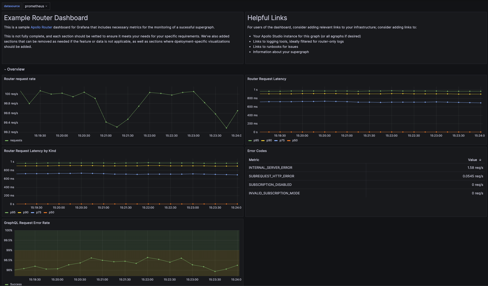

# WIP: Apollo Router Grafana Dashboard Example

> Note: This is the first draft of a Grafana template. It has not had the same iterations as the
> other templates.



This repository contains a [JSON file](./graphos-template.json) containing an example
[Grafana](https://grafana.com/oss/grafana/) dashboard for reference or use with the Apollo Router.

**The code in this repository is experimental and has been provided for reference purposes only.
Community feedback is welcome but this project may not be supported in the same way that
repositories in the official [Apollo GraphQL GitHub organization](https://github.com/apollographql)
are. If you need help you can file an issue on this repository,
[contact Apollo](https://www.apollographql.com/contact-sales) to talk to an expert, or create a
ticket directly in Apollo Studio.**

## Installation

This repository contains the JSON needed to
[import as a new dashboard](https://grafana.com/docs/grafana/latest/dashboards/build-dashboards/import-dashboards/)
in your Grafana instance.

### Dashboard Requirements

This dashboard requires:
- Grafana
- A Prometheus datasource
- Prometheus gathering metrics from the Apollo Router running v2.0 or higher

This dashboard also leverages the following telemetry configuration for the router:

```yaml
telemetry:
  instrumentation:
    instruments:
      default_requirement_level: required
      router:
        http.server.request.duration:
          attributes:
            graphql.operation.name:
              operation_name: string
            graphql.errors:
              on_graphql_error: true
        http.server.request.body.size: true
        http.server.response.body.size: true
        http.server.active_requests: true
      subgraph:
         http.client.request.duration:
            attributes:
               subgraph.name: true
               graphql.errors:
                  subgraph_on_graphql_error: true
               http.response.status_code: 
                  subgraph_response_status: code
        http.client.request.body.size:
          attributes:
            subgraph.name: true
        http.client.response.body.size: true
```

### Usage

Once imported, select your datasource in the top variable section and the dashboard should populate so long as you use the standard metric values.

Dashboard variables:
- `otel_scope_name` - Filter by OpenTelemetry scope name (default: "apollo/router")

### Known Limitations

- The template does not include any panels for resource views; this data is often bespoke to the environments in which the router is run, therefore it is easier to add your own panels from the correct datasources.

- There are sections for resources, however, to be able to input the necessary panels.

## Comparison: Grafana vs Datadog Templates

This section provides a detailed comparison between the Grafana template (`graphos-template-new.json`) and the Datadog template (`datadog/graphos-template.json`) to help you understand the differences and choose the appropriate template for your monitoring stack.

### Platform & Query Language Differences

| Aspect | Grafana Template | Datadog Template |
|--------|------------------|------------------|
| **Platform** | Grafana (open-source) | Datadog (commercial SaaS) |
| **Query Language** | Prometheus/PromQL | Datadog Query Language |
| **Datasource** | Prometheus | Datadog Metrics API |
| **Metric Naming** | OpenTelemetry format (snake_case with `_seconds`, `_bytes` suffixes) | Datadog format (dot notation, e.g., `http.server.request.duration`) |
| **Example Query** | `rate(http_server_request_duration_seconds_count{otel_scope_name="apollo/router"}[$__rate_interval])` | `count:http.server.request.duration{$service,$env,$version}.as_count()` |

### Template Variables

**Grafana Template:**
- `datasource` - Prometheus datasource selection
- `otel_scope_name` - OpenTelemetry scope name filter (default: "apollo/router")

**Datadog Template:**
- `service` - Service name filter (default: "router")
- `env` - Environment filter (default: "prod")
- `version` - Version filter (default: "*")

### Section Coverage Comparison

#### ✅ Sections Present in Both Templates

1. **Request Traffic & Health: Client → Router**
   - Volume of requests per status code
   - Throughput (requests per second)
   - Error rate percentage
   - GraphQL errors by operation name

2. **Request Characteristics: Client → Router**
   - Request body size (p99/max)

3. **Request Performance & Latency: Client → Router**
   - Request duration distribution (histogram)
   - Request duration percentiles (p90, p95, p99, min, max)

4. **Request Traffic & Health: Router → Backend**
   - HTTP requests by subgraph/connector
   - Throughput (requests per second)
   - Non-2xx responses breakdown
   - GraphQL errors by subgraph

5. **Request Performance & Latency: Router → Backend**
   - P95 latency by subgraph
   - P95 latency by operation name
   - Request duration distribution (histogram for backend requests)

6. **Top Most Queried Subgraphs: Request Duration Distributions**
   - Request duration distributions grouped by subgraph ✅

7. **Top Most Queried Connector Sources: Request Duration Distributions**
   - Request duration distributions grouped by connector source ✅

8. **Query Planning**
   - Duration and wait time
   - Evaluated plans

9. **Cache**
   - Misses vs. record count
   - Cache hit percentage
   - Record counts by instance ✅
   - Record counts by type ✅

10. **Coprocessors**
   - Request duration
   - Request count
   - Success rate

#### 📊 Additional Sections in Datadog Template Only

1. **Request Characteristics: Router → Backend**
   - Response body size tracking

2. **Router → Backend Advanced Metrics**
   - Subgraph performance profiles (scatter plots: throughput vs latency)
   - Connector source performance profiles (scatter plots)

3. **Top Most Queried Subgraphs/Connectors**
   - Dynamic distribution charts for top 12 most queried subgraphs ✅ (Note: Grafana shows all subgraphs; users can filter via legend)
   - Dynamic distribution charts for top 12 most queried connector sources ✅ (Note: Grafana shows all connector sources; users can filter via legend)

4. **Cache (Extended)**
   - Record counts by instance ✅
   - Record counts by type ✅
   - Misses by type
   - Hit % by instance

5. **Compute Jobs**
   - Query planning duration percentiles and wait time
   - Query parsing duration percentiles and wait time
   - Queued jobs
   - Job counts by outcome

6. **Container/Host Resource Monitoring**
   - Kubernetes CPU usage
   - Kubernetes memory usage
   - Host CPU usage (OTEL Collector - Hostmetrics)
   - Host memory usage (OTEL Collector - Hostmetrics)
   - Docker CPU usage (multiple collectors)
   - Docker memory usage (multiple collectors)

7. **Sentinel Metrics**
   - Uplink and licensing metrics
   - Open connections by schema and launch ID
   - Router relative overhead

### Key Functional Differences

#### Metric Aggregation

**Grafana:**
- Uses Prometheus rate functions: `rate()`, `histogram_quantile()`
- Relies on Prometheus histogram buckets for percentiles
- Uses `$__rate_interval` for automatic rate interval calculation

**Datadog:**
- Uses Datadog aggregations: `.as_count()`, `.as_rate()`, `p95:`, `p99:`, etc.
- Built-in percentile calculations
- Uses anomaly detection functions: `anomalies()`

#### Visualization Types

**Grafana:**
- Standard Grafana panel types (timeseries, histogram, text)
- Uses row panels for section organization
- Panel repeat functionality for dynamic subgraph/connector charts (in full template)

**Datadog:**
- Datadog-specific widget types (timeseries, distribution, scatterplot, split_group)
- Group widgets for section organization
- Split group widgets for dynamic multi-panel views

#### Error Handling

**Grafana:**
- Uses `or vector(0)` and `or vector(1)` for safe division in error rate calculations
- PromQL null handling

**Datadog:**
- Uses Datadog formula syntax with built-in null handling
- Formula-based calculations: `(query1 + query2) / query3 * 100`

### Panel Count Comparison

- **Grafana Template (graphos-template-new.json)**: ~40 panels (streamlined version)
- **Grafana Template (graphos-template.json)**: ~65 panels (full version)
- **Datadog Template**: ~60+ widgets (comprehensive version)

### When to Use Each Template

**Use Grafana Template if:**
- You're using Prometheus for metrics collection
- You prefer open-source solutions
- You want to customize queries and panels extensively
- You're running Grafana in your infrastructure
- You need a lightweight, focused dashboard

**Use Datadog Template if:**
- You're already using Datadog for monitoring
- You want comprehensive resource monitoring (CPU, memory, containers)
- You need advanced features like anomaly detection
- You want performance profile scatter plots
- You need detailed cache breakdowns by instance and type
- You want compute job monitoring (query parsing, queued jobs)

### Migration Considerations

If migrating between platforms:

1. **Metric Names**: Convert between OpenTelemetry format (Grafana) and Datadog format
   - Grafana: `http_server_request_duration_seconds_count`
   - Datadog: `http.server.request.duration`

2. **Query Syntax**: Rewrite PromQL queries to Datadog query language or vice versa

3. **Template Variables**: Adapt variable definitions to each platform's format

4. **Visualization Types**: Some chart types may not have direct equivalents (e.g., Datadog's scatterplot performance profiles)

5. **Missing Features**: Some Datadog-specific features (anomaly detection, split groups) may need alternative implementations in Grafana