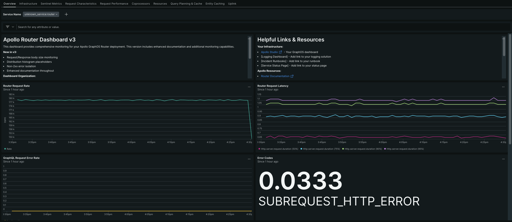

# WIP: Apollo Router New Relic Dashboard Example

> Note: This is the first draft of a New Relic template. It has not had the same iterations as the
> other templates.



This repository contains a [JSON file](./example-dashboard.json) containing an example
[New Relic](https://newrelic.com/oss/newrelic/) dashboard for reference or use with the Apollo
Router.

## Dashboard Pages

The dashboard includes the following pages:

| Page                    | Description                                              | Screenshot                                           |
| ----------------------- | -------------------------------------------------------- | ---------------------------------------------------- |
| Overview                | High-level health metrics and request rates              | [View](./screenshots/01-overview.png)                |
| Infrastructure          | CPU, memory, and system resource monitoring              | [View](./screenshots/02-infrastructure.png)          |
| Sentinel Metrics        | SLOs, health scores, and alert recommendations           | [View](./screenshots/03-sentinel-metrics.png)        |
| Request Characteristics | Body sizes and error pattern analysis                    | [View](./screenshots/04-request-characteristics.png) |
| Request Performance     | Detailed breakdown by subgraph, operation, and connector | [View](./screenshots/05-request-performance.png)     |
| Coprocessors            | Coprocessor latency and success metrics                  | [View](./screenshots/06-coprocessors.png)            |
| Resources               | System-level resource monitoring                         | [View](./screenshots/07-resources.png)               |
| Query Planning & Cache  | Query planning performance, caching, and compute jobs    | [View](./screenshots/08-query-planning-cache.png)    |
| Entity Caching          | Entity cache hit rates and performance                   | [View](./screenshots/09-entity-caching.png)          |
| Uplink                  | Schema fetching and uplink health                        | [View](./screenshots/10-uplink.png)                  |

**The code in this repository is experimental and has been provided for reference purposes only.
Community feedback is welcome but this project may not be supported in the same way that
repositories in the official [Apollo GraphQL GitHub organization](https://github.com/apollographql)
are. If you need help you can file an issue on this repository,
[contact Apollo](https://www.apollographql.com/contact-sales) to talk to an expert, or create a
ticket directly in Apollo Studio.**

## Installation

This repository contains the JSON needed to
[import as a new dashboard](https://docs.newrelic.com/docs/query-your-data/explore-query-data/dashboards/introduction-dashboards/#dashboards-import)
in your New Relic instance.

This dashboard requires:

- New Relic

This dashboard also leverages the following telemetry configuration for the router, similar to
[the configuration](https://www.apollographql.com/docs/graphos/routing/observability/router-telemetry-otel/apm-guides/datadog/router-instrumentation#complete-configuration)
required for the Datadog template:

```yaml
telemetry:
  instrumentation:
    spans:
      default_attribute_requirement_level: recommended

      router:
        attributes:
          otel.name: router
          operation.name: "router"
          resource.name:
            request_method: true

      supergraph:
        attributes:
          otel.name: supergraph
          operation.name: "supergraph"
          resource.name:
            operation_name: string
          # Error tracking
          otel.status_code:
            static: ERROR
            condition:
              eq:
                - true
                - on_graphql_error: true
          error.message:
            response_errors: $[0].message

      subgraph:
        attributes:
          otel.name: subgraph
          operation.name: "subgraph"
          resource.name:
            subgraph_operation_name: string
          otel.status_code:
            static: ERROR
            condition:
              eq:
                - true
                - subgraph_on_graphql_error: true
          error.message:
            subgraph_response_errors: $[0].message

    instruments:
      default_requirement_level: required

      router:
        http.server.request.duration:
          attributes:
            graphql.errors:
              on_graphql_error: true

      subgraph:
        http.client.request.duration:
          attributes:
            subgraph.name: true
            graphql.errors:
              subgraph_on_graphql_error: true
```

## Usage

Before importing into New Relic, in the `example-dashboard.json`, you must search and replace all of
the `[<YOUR-ACCOUNT-ID>]` with `[1234567]`, or a longer list of ID's `[1234567,2345678,3456789]` if
you need to pull data from multiple New Relic accounts simultaneously.

Once you've made this adjustment, you can import into New Relic in one of two ways:

### Option 1: Manual Import via New Relic UI

1. Log into New Relic
2. Navigate to [Dashboards](https://one.newrelic.com/dashboards)
3. Select `Import Dashboard` from the upper right
4. Copy and paste the JSON from `example-dashboard.json`

### Option 2: Import via Script

Use the `import-single-dashboard.sh` script in this repository:

```shell
NEW_RELIC_USER_API_KEY=your-api-key-here \
NEW_RELIC_ACCOUNT_ID=1234567 \
./import-single-dashboard.sh example-dashboard.json
```

To get your New Relic User API Key, visit: https://one.newrelic.com/admin-portal/api-keys/home
